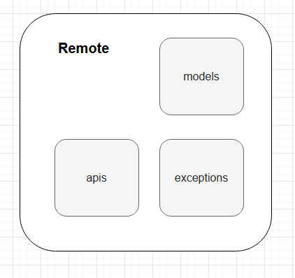

Base flutter [Work in progress 🚧]
==================

## Goals
- Easy for developers to understand, nothing too experimental.
- Support multiple developers working on the same codebase.
- Minimize build times.

## Architecture overview
Use BLoC design pattern
> Bloc is a design pattern created by Google to help separate business logic from the presentation layer and enable a developer to reuse code more efficiently.

To archive this, we use [a state management library called Bloc](https://pub.dev/packages/bloc) was created and maintained by Felix Angelo.<br>
The app has two layers: ```Data layer``` and ```UI layer``` (called presentation)


### Data flow
The architecture follows a reactive programming model with unidirectional data flow:
1. User trigger an event (press button on screen .etc.)
2. The ```View``` will send that event to ```bloc```
3. ```bloc``` handle the event and request corresponding data from ```repository```
4. ```repository``` request data from ```data provider```
5. ```data provider``` is the data source, could from ```cache``` or ```remote```. After got the data, return to ```repository```
6. ```repository``` could do some logic like sync data and return the requested data to ```bloc```. ```bloc``` updates the state.
7. While ```view``` is observing ```bloc```, it will receive the state corresponding to the sent event and update the interface

### Models mapping
For best maintainability, I decided to use four types of models in the app:
1. Cache Entity: model to read & write in cache
2. Remote DTO: model parsed from network
3. Domain Model: app model, nearly don't change
4. Ui Data: display data in ui

To analyze this approach:
<br><br><b>Pros:</b>
- Code is clearer when the model is decoupled by layers
- Easily maintain the codebase, especially case data from network change too often
- Ui data helps us to increase performance better 🤫

<b>Cons:</b>
- Need to write more code

## Deep dive into Architecture
So above is the concept of this architecture. But how is it actually implemented in each layer?
### (Data Layer) Data Provider
#### Remote

- Models: Dto models
- Exceptions: handle all exceptions from server. Example when server response with a incorrect status, such as 404, 503...
- Clients: call api here, using [Dio](https://pub.dev/packages/dio) for making network request
```dart
Future<List<SampleDto>> fetchCompute() async {
    final Response<String> response = await _dio.request("/photos");
    return JsonExtensions.parseObjectsCompute<SampleDto>(
      JsonParser(
        responseBody: response.data.toString(),
        fromJson: (json) => SampleDto.fromJson(json),
      ),
    );
  }
```
The ```JsonExtensions``` is a utility class help convert json to corresponding model in background or not.

#### Cache [Work in progress 🚧]

### (Data Layer) Repository
Get the data from cache or remote then map to domain model
```dart
Future<Result<List<SampleModel>>> fetch() async {
    return Result.guardFuture(
      () async => (await _sampleApiClient.fetchCompute()).mapToModel(),
      _exceptionHandler,
    );
  }
```
The ```Result.guardFuture()``` simply wraps ```Future``` with try catch. Also we have ```Result.guard()``` does the samething but not ```Future```. See more in ```result.dart``` class
<br>The ```mapToModel``` is an extension, put in the Dto model
```dart
extension _Mapper on SampleDto {
  SampleModel? mapToModel() {
    if (id == null || albumId == null) return null;
    return SampleModel(
      id: id!,
      albumId: albumId!,
      title: title.orEmpty(),
      url: url.orEmpty(),
      thumbnailUrl: thumbnailUrl.orEmpty(),
    );
  }
}

extension ListMapper on List<SampleDto> {
  List<SampleModel> mapToModel() {
    return map((e) => e.mapToModel()).whereType<SampleModel>().toList();
  }
}
```

### Presentation Layer
This layer doesn't have much to say. You can deploy as you like, but for consistency try to follow the following package organization:

- feature_name/
  - ```logic/``` cubits, blocks, event 
  - ```models/``` ui data
  - ```view/``` your screen/page (for consistency use ```page``` for naming view)
  - ```widgets/``` widgets use for page
  
## Navigation
Use ```onGenerateRoute``` for setting up routes. All available routes will be declared in ```AppRouter```.
<br>Add new route:
```dart
/// create const route's name
 static const String sample = 'sample';
 /// declare in onGenerateRoute
 static Route onGenerateRoute(RouteSettings settings) {
 ...
    case sample:
      return MaterialPageRoute(
        builder: (_) => const SamplePage(),
      );
  ...
  }
 ```
 Navigate:
 ```dart
Navigator.of(context).pushNamed(AppRouter.sample);
 ```

## Design system [Work in progress 🚧]
DS organization in ```core/ui``` folder.

## Naming convention
- Follow [offical guidance](https://dart.dev/guides/language/effective-dart/style)
- ```package``` try not use "_". Example ```home_tracking``` can be replaced with ```tracking/home```
- Util extension end with ```_ext```. Example ```json_ext```
- bloc event end with ```Event```. Example ```SampleRequestDataEvent```, ```SampleClearRequestedDataEvent```
- bloc state end with ```State```. Example ```SampleState```, ```SampleLoadingState```
- models:
  - domain model: end with Model (SampleModel)
  - remote model: end with Dto (SampleDto)
  - cache model: end with Entity (SampleEntity)
  - ui model: end with UiData (SampleUiData)

## Build
get dependencies
```dart
flutter packages get
```

run build runner for generating needed classes
```dart
 flutter pub run build_runner build --delete-conflicting-outputs  
```

## Todo
- [x] Base data flow using BLoC pattern
- [x] Basic usages of bloc to manage app state
- [x] Handle exceptions from API
- [x] [Mobile] Json decode in background
- [ ] [Web] Json decode in background
- [ ] Implement cache data provider
- [x] Design system: snackbar
- [ ] Design system: typography
- [ ] Design system: colors, theme
- [ ] Add useful extensions for String based on kotlin
- [ ] Add useful extensions for List based on kotlin
- [ ] Refactoring a lotttt when I have more experience with Flutter 🥺
